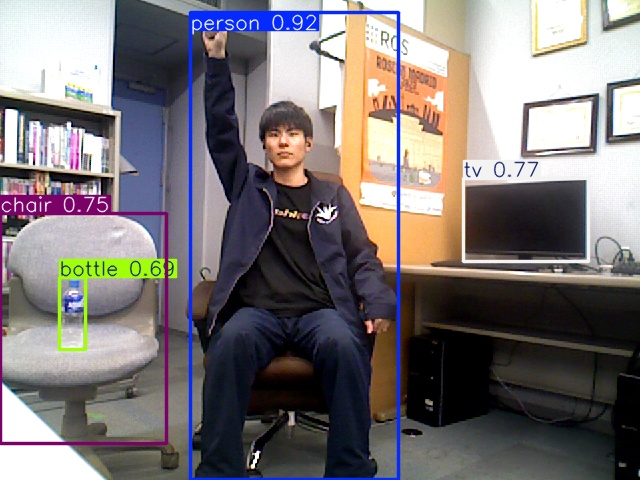
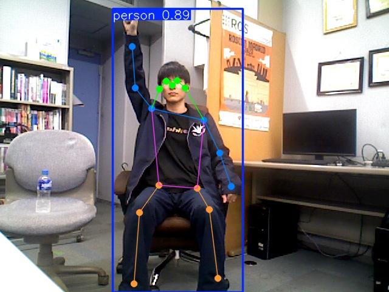
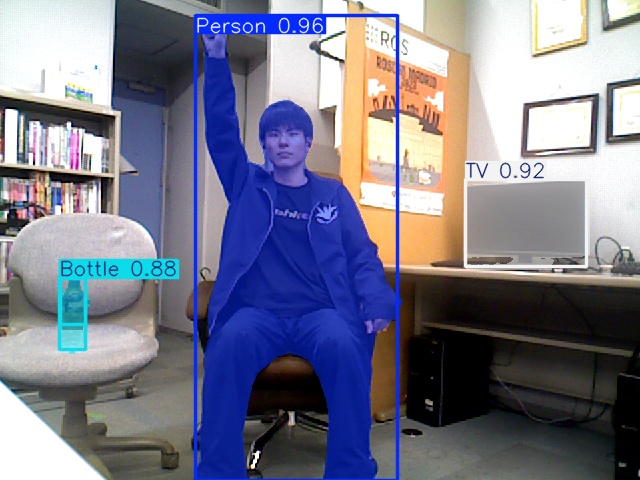

<a name="readme-top"></a>

[EN](README.md) | [JA](README_ja.md)

[![Contributors][contributors-shield]][contributors-url]
[![Forks][forks-shield]][forks-url]
[![Stargazers][stars-shield]][stars-url]
[![Issues][issues-shield]][issues-url]
[![License][license-shield]][license-url]

# YOLO ROS

<details>
  <summary>目次</summary>
  <ol>
    <li><a href="#概要">概要</a></li>
    <li>
      <a href="#セットアップ">セットアップ</a>
      <ul>
        <li><a href="#環境条件">環境条件</a></li>
        <li><a href="#インストール方法">インストール方法</a></li>
      </ul>
    </li>
    <li><a href="#実行操作方法">実行・操作方法</a></li>
    <li><a href="#パラメーター">パラメーター</a></li>
    <li><a href="#トピック">トピック</a></li>
    <li><a href="#デモ">デモ</a></li>
    <li><a href="#参考文献">参考文献</a></li>
  </ol>
</details>

## 概要
`yolo_ros` は，Ultralytics YOLO モデル（YOLO26 系の検出・姿勢推定・セグメンテーション・回転した枠（OBB），および YOLOE）を ROS 2 で利用するためのライフサイクル対応ラッパーパッケージです．

**主な機能：**
- 物体検出（`Detection2DArray`）
- 人物姿勢推定（`KeyPointArray`）
- インスタンスセグメンテーション（`DetectMaskArray`）
- 回転した枠（OBB）による検出：斜めの車や船を回転した枠で囲む（`Detection2DArray` の `bbox.center.theta` に角度）
- YOLO トラッキング（BoT-SORT / ByteTrack，`track_id` 付き `Detection2DArray`）
- YOLOE によるプロンプトベースの検出・セグメンテーション
- Conv+BN 層の融合による高速化（`fuse`）
- ROS 2 ライフサイクル完全対応（`configure` → `activate` → `deactivate` → `cleanup`）
- 全パラメーターを `ros2 param set` でランタイムに変更可能

<p align="right">(<a href="#readme-top">上に戻る</a>)</p>


## セットアップ

### 環境条件

| システム | バージョン |
| -------- | ---------- |
| Ubuntu   | 24.04 (Noble Numbat) |
| ROS 2    | Jazzy Jalisco |
| Python   | 3.12 |

### インストール方法
1. ROS 2 の `src` フォルダに移動します．
   ```sh
   cd ~/colcon_ws/src/
   ```
2. 本レポジトリをクローンします．
   ```sh
   git clone https://github.com/TeamSOBITS/yolo_ros.git
   ```
3. レポジトリの中へ移動し，依存パッケージをインストールします．
   ```sh
   cd yolo_ros
   bash install.sh
   ```
4. パッケージをビルドします．
   ```sh
   cd ~/colcon_ws/
   colcon build --symlink-install
   source install/setup.bash
   ```

<p align="right">(<a href="#readme-top">上に戻る</a>)</p>


## 実行・操作方法

### GUI で設定して使う

```sh
ros2 launch yolo_ros yolo.launch.py use_gui:=true
```

OSNet ROS と同じ見た目の GUI（`yolo_gui`）が開き，カメラ・YOLO の起動/停止と，次の表の設定をすべて画面から切り替えられます．GUI を使うときは，YOLO はモデルを読み込んだ状態で待ち，「起動」タブの「起動」で動き始めます．GUI を閉じると launch 全体が終了します．GUI で選んだ設定は `~/.local/share/yolo_ros/gui_settings.json`（環境変数 `YOLO_ROS_DATA_ROOT` で変更可）に保存され，次回も同じ設定で起動します．

| タブ | できること |
| ---- | ---------- |
| 起動 | カメラ・YOLO の起動/停止，処理状況（処理 FPS・受信 FPS・推論 ms・1 フレームの処理 ms・遅延 ms・検出数），検出中の ID（`person:1` など），ログ |
| カメラ | 内蔵/USB カメラ（`yolo_camera` で `/image_raw` に配信．解像度・FPS を選択）か，任意の `sensor_msgs/Image` トピックを選ぶ．処理の上限（`max_rate_hz`），画像の受信方法（`image_reliability`） |
| 検出 | モデル（`weights_path` の重みファイル．検出・姿勢・セグメンテーション・回転した枠（OBB）・YOLOE），Track / Detect，`conf`，`iou`，入力サイズ（`imgsz`），半精度（`half`），検出する物体（モデルのクラス一覧から選ぶ．YOLOE のときは探す物を文字で入力） |
| 追跡 | トラッカー（BoT-SORT，ByteTrack，OC-SORT，Deep OC-SORT，FastTrack，TrackTrack），トラッカーの ReID と ReID モデル，導線（なし/枠の中心/キーポイント/両方，長さ，線の太さ，描く点） |
| 姿勢 | 配信するキーポイント，人とみなす条件（選んだ点がすべて見えている人だけを残す） |
| 3D | image_to_position の `bbox_to_3d`・`keypoint_to_3d`・`mask_to_3d` の起動/停止（入力は自動で `yolo_node/object_*` につなぐ） |

プレビューは 1 画面 / 2 画面で，画面ごとに「YOLO（検出・導線）」か「カメラ映像」を選べます．スクショは PNG で `<データの場所>/screenshots/` に保存します．モデル・トラッカー・画像の受信方法の変更は YOLO を一瞬止めて切り替え，それ以外はそのまま反映されます．

### 起動時に launch で設定して使う

1. 物体検出モードで起動します：
   ```sh
   ros2 launch yolo_ros yolo.launch.py image_topic_name:=/camera/color/image_raw mode:=detect
   ```

2. トラッキングモードで起動します：
   ```sh
   ros2 launch yolo_ros yolo.launch.py image_topic_name:=/camera/color/image_raw mode:=track
   ```

   トラッカーは `botsort.yaml`，`bytetrack.yaml`，`ocsort.yaml`，`deepocsort.yaml`，`fasttrack.yaml`，`tracktrack.yaml` を指定できます．

3. 起動時に自動で configure・activate する既定値は `true` です：
   ```sh
   ros2 launch yolo_ros yolo.launch.py auto_configure_2d:=true auto_activate_2d:=true
   ```

4. 3D 座標変換パイプラインを有効にする場合：
   ```sh
   ros2 launch yolo_ros yolo.launch.py use_bbox_to_3d:=true use_keypoint_to_3d:=false use_mask_to_3d:=false
   ```

   入力トピック（`<node_name>/object_boxes` など）は image_to_position の launch 引数 `bbox_topic_name` / `keypoint_topic_name` / `mask_topic_name` で自動的に渡します．点群・カメラ情報のトピックと座標系は `image_to_position/config/*.yaml` の値を使います．

5. 推論の入力サイズや半精度を指定する場合：
   ```sh
   ros2 launch yolo_ros yolo.launch.py imgsz:=960 half:=true max_rate_hz:=15
   ```

### 起動後に lifecycle / param で切り替えて使う

1. ライフサイクルを手動で管理する場合：
   ```sh
   ros2 launch yolo_ros yolo.launch.py auto_configure_2d:=false auto_activate_2d:=false
   ros2 lifecycle set /yolo_node configure
   ros2 lifecycle set /yolo_node activate
   ```

2. ランタイムにモデルを切り替える場合（`weight_file` や `tracker`，`tracker_with_reid`，`tracker_reid_model` は deactivate が必要）：
   ```sh
   ros2 lifecycle set /yolo_node deactivate
   ros2 param set /yolo_node weight_file yolo26n-pose.pt
   ros2 lifecycle set /yolo_node activate
   ```

3. トラッキングモードへ切り替える場合：
   ```sh
   ros2 lifecycle set /yolo_node deactivate
   ros2 param set /yolo_node yolo_mode track
   ros2 param set /yolo_node tracker tracktrack.yaml
   ros2 lifecycle set /yolo_node activate
   ```

4. 物体検出モードへ戻す場合：
   ```sh
   ros2 param set /yolo_node yolo_mode detect
   ```

<p align="right">(<a href="#readme-top">上に戻る</a>)</p>


## パラメーター

以下のパラメーターはランチファイルまたは `ros2 param set` で設定できます．

| パラメーター名         | 説明                                                                                          | デフォルト値                        | ランタイム変更  |
| ---------------------- | --------------------------------------------------------------------------------------------- | ----------------------------------- | --------------- |
| `weight_file`          | YOLO の重みファイル名                                                                         | `yolo26n.pt`                        | inactive 時のみ |
| `weights_path`         | 重みファイルが格納されているディレクトリ                                                       | `<package>/weights`                 | inactive 時のみ |
| `conf`                 | 検出の信頼度閾値（0.0, 1.0]                                                                   | `0.5`                              | 可              |
| `iou`                  | NMS の IoU 閾値（0.0, 1.0]                                                                    | `0.7`                               | 可              |
| `yolo_mode`            | ノード本体の実行モード。`detect` で `predict()`，`track` で `track()` を使う．切り替えてもトラッカーは保持するので，同じ人物はtrackに戻っても同じ ID のまま | `detect`                            | 可              |
| `max_rate_hz`          | カメラ画像を処理する上限の Hz．`0` で制限なし（カメラのフレームを全部処理）．超えた分のフレームは捨てる | `0.0` | 可 |
| `image_topic_name`     | 入力カメラ画像の topic．実行中に変更すると購読し直し，トラッカーをリセットする | `camera/color/image_raw` | 可 |
| `tracker`              | tracking モードで使う Ultralytics のトラッカー設定（`botsort.yaml`，`bytetrack.yaml`，`ocsort.yaml`，`deepocsort.yaml`，`fasttrack.yaml`，`tracktrack.yaml`） | `tracktrack.yaml` | inactive 時のみ |
| `tracker_with_reid`    | 対応するトラッカー（BoT-SORT，Deep OC-SORT，TrackTrack）で ReID を使うか．ReID のないトラッカー（ByteTrack，OC-SORT，FastTrack）ではこの値は無視されるので，`tracker:=bytetrack.yaml` だけを指定してもそのまま起動できます | `true`                              | inactive 時のみ |
| `tracker_reid_model`   | ReID モデルのファイル名またはパス。`.onnx`，`.engine`，`.torchscript`，`.openvino`，`.pt` を指定可能 | `yolo26m-reid.onnx` | inactive 時のみ |
| `tracker_reid_weights_path` | `tracker_reid_model` をファイル名だけで指定したときに参照するディレクトリ                 | `<package>/weights`                 | inactive 時のみ |
| `use_tracking`         | 旧互換パラメーター。`true` で `track`，`false` で `detect` に対応                             | `false`                             | 可              |
| `use_detection_filter` | `config/detection_filters.yaml` などから与えた `filter_classes` を使うか                      | `true`                              | 可              |
| `filter_classes`       | YOLO の検出・描画・トラッキング対象を絞り込むクラス名のリスト（空または空文字のみ = 全クラス） | `['person', 'bottle']`              | 可              |
| `keypoint_publish_names` | 姿勢推定で publish するキーポイント名のリスト                                               | `['nose', 'left_wrist']`            | 可              |
| `person_keypoint_filter_names` | person として残すために必要なキーポイント名のリスト                                 | `['nose']`                          | 可              |
| `keypoint_trail_names` | 姿勢推定トラッキングで導線を描くキーポイント名のリスト                                       | `['left_wrist']`                    | 可              |
| `use_person_keypoint_filter` | `person_keypoint_filter_names` を pose の person 判定に使うか．launch の既定は `false`（後ろ姿の人も残すため） | `false`                             | 可              |
| `trail_mode`          | 導線モード。`false`，`bbox`，`keypoint`，`all` を選択                                         | `bbox`                              | 可              |
| `yoloe_prompts`        | YOLOE モデルで使用するテキストプロンプト（YOLOE 使用時は必須）                                | `['']`                              | 可              |
| `image_reliability`    | 画像サブスクリプションの QoS 信頼性．`auto` は reliable と best_effort の両方で購読し，どちらのカメラでも取りこぼしなく受信します（best_effort だけだと reliable カメラの大きな画像をほとんど落とします）．`best_effort`，`reliable`，`system_default` なども指定可 | `auto`                              | inactive 時のみ |
| `device`               | 推論デバイス（`cuda`，`cpu`，`cuda:0` など）                                                  | CUDA 利用可能なら `cuda`，否は `cpu` | inactive 時のみ |
| `fuse`                 | ロード後に Conv+BN 層を融合して推論を高速化するか                                              | `true`                              | inactive 時のみ |
| `imgsz`                | 推論の入力サイズ（px）．大きいほど遠くの小さな物を見つけやすいが，推論時間はおよそ面積に比例して増える | `640` | 可 |
| `half`                 | 半精度（FP16）で推論するか．CUDA で速くなり，CPU では効果なし．切り替えるとトラッキング ID は振り直される | `false` | 可 |
| `trail_length`         | 導線に残すフレーム数                                                                          | `30`                                | 可              |
| `line_width`           | `detected_image` の枠と導線の線の太さ                                                         | `2`                                 | 可              |
| `use_gui`              | （launch 引数）GUI（`yolo_gui`）を起動するか．`true` のとき YOLO は GUI の「起動」まで待つ     | `false`                             | —               |
| `auto_configure_2d`    | 起動時に YOLO ライフサイクルノードを Configure するか                                         | `true`                              | —               |
| `auto_activate_2d`     | 起動時に YOLO ライフサイクルノードを Activate するか                                          | `true`                              | —               |
| `auto_configure_3d`    | 起動時に image_to_position ライフサイクルノードを Configure するか                            | `false`                             | —               |
| `auto_activate_3d`     | 起動時に image_to_position ライフサイクルノードを Activate するか                             | `false`                             | —               |
| `use_bbox_to_3d`       | `bbox_to_3d` の3D検出パイプラインを起動するか                                                 | `false`                             | —               |
| `use_keypoint_to_3d`   | `keypoint_to_3d` の3Dパイプラインを起動するか                                                 | `false`                             | —               |
| `use_mask_to_3d`       | `mask_to_3d` の3Dパイプラインを起動するか                                                     | `false`                             | —               |

> **注意：** `weight_file`，`weights_path`，`device`，`fuse`，`image_reliability`，`tracker`，`tracker_with_reid`，`tracker_reid_model`，`tracker_reid_weights_path` は，ノードが `inactive`（deactivate 済み）状態のときのみ変更できます．

<p align="right">(<a href="#readme-top">上に戻る</a>)</p>


## トピック

### 配信（Publications）

| トピック名                  | 型                                    | 説明                                       |
| --------------------------- | ------------------------------------- | ------------------------------------------ |
| `<node>/detected_image`     | `sensor_msgs/Image`                   | アノテーション付き可視化画像．購読者がいないときは描画を省略して処理を軽くします（導線もその間はリセット） |
| `<node>/object_boxes`       | `vision_msgs/Detection2DArray`        | 検出インスタンスごとのバウンディングボックス．検出が0件のフレームでも空配列を配信します．OBB モデルでは `bbox.center.theta` に枠の回転角（ラジアン）が入ります |
| `<node>/object_keypoints`   | `sobits_interfaces/KeyPointArray`     | キーポイント（姿勢推定モデル使用時）．同じフレームの `object_boxes` の直前に，同じ header・同じ順番で publish します（空でも publish．見えない点は (0, 0)） |
| `<node>/object_masks`       | `sobits_interfaces/DetectMaskArray`   | インスタンスマスク（セグメンテーションモデル使用時）．検出が0件のフレームでも空配列を配信します |
| `<node>/stats`              | `std_msgs/String`（JSON）             | 1 秒ごとの処理状況：`received_fps`（届いたフレーム），`processed_fps`（処理したフレーム），`inference_ms`（前処理・推論・後処理），`callback_ms`（描画・配信を含む 1 フレームの処理），`latency_ms`（画像の header.stamp から配信まで．カメラと時計が違うときは `null`），`detections`，`imgsz`，`half`，`mode` |
| `<node>/detect_response`    | `vision_msgs/Detection2DArray`        | `detect_request` への応答．header は要求画像のものをそのまま返します |
| `<node>/model_info`         | `std_msgs/String`（JSON）             | 読み込み中のモデルの `weight_file`・`classes`（クラス ID 順の名前）・`keypoints`．モデルを読み込むたびに publish（transient local なので後から購読しても最新が届く）．GUI が検出する物体の選択肢に使います |

### 購読（Subscriptions）

| トピック名             | 型                      | 説明               |
| ---------------------- | ----------------------- | ------------------ |
| `<image_topic_name>`   | `sensor_msgs/Image`     | 入力カメラ画像     |
| `<node>/detect_request` | `sensor_msgs/Image`    | 単発の検出要求（osnet_ros の登録画像など）．トラッカーを通さず，人物キーポイントフィルタも適用しません |

> `<node>` のデフォルトは `yolo_node` です．ランチ引数 `node_name` で変更できます．トラッキング有効時，`Detection2D.id` と `DetectMask.instance_id` には `person:1` のように `クラス名:track_id` が入ります．クラス名自体は `Detection2D.results[].hypothesis.class_id` にも保持されます．`detect` モードではトラッカーを使わないので，実行中に `track` から `detect` へ切り替えた場合も ID は付きません．

<p align="right">(<a href="#readme-top">上に戻る</a>)</p>


## デモ

| 物体検出 | 姿勢推定 | セグメンテーション |
|:---:|:---:|:---:|
|  |  |  |

### 物体検出
```bash
ros2 lifecycle set /yolo_node deactivate
ros2 param set /yolo_node weight_file yolo26n.pt
ros2 param set /yolo_node filter_classes "['person', 'laptop']"
ros2 lifecycle set /yolo_node activate
```

### 姿勢推定
```bash
ros2 lifecycle set /yolo_node deactivate
ros2 param set /yolo_node weight_file yolo26n-pose.pt
ros2 param set /yolo_node keypoint_publish_names "['nose', 'left_eye', 'right_eye']"
ros2 lifecycle set /yolo_node activate
```

#### キーポイント設定

| 項目 | 役割 |
|------|------|
| `keypoint_publish_names` | `/object_keypoints` に publish する点 |
| `person_keypoint_filter_names` | `use_person_keypoint_filter:=true` のときに，person として残すために必要な点 |
| `keypoint_trail_names` | `trail_mode:=keypoint` または `trail_mode:=all` のときに導線を描く点 |

`person_keypoint_filter_names` は，書いた点がすべて見えている detection だけを person として残します．空配列 `[]` ならフィルタしません．

### セグメンテーション
```bash
ros2 lifecycle set /yolo_node deactivate
ros2 param set /yolo_node weight_file yolo26n-seg.pt
ros2 lifecycle set /yolo_node activate
```

### 回転した枠（OBB）

斜めに写った車や船などを，回転した枠で囲みます．

```bash
ros2 lifecycle set /yolo_node deactivate
ros2 param set /yolo_node weight_file yolo26n-obb.pt
ros2 lifecycle set /yolo_node activate
```

- 結果は通常の検出と同じ `<node>/object_boxes`（`Detection2DArray`）に出ます．`bbox.center.position` が枠の中心，`bbox.size_x` / `size_y` が回転した枠の幅と高さ，`bbox.center.theta` が回転角（ラジアン．Ultralytics の値をそのまま）です．通常のモデルでは `theta` は常に `0` です．
- Track モード（ID 付き），クラスの絞り込み，導線（枠の中心）もそのまま使えます．
- 標準の OBB モデルは空撮画像（DOTA：飛行機・船・車・橋など 15 種類）で学習しているため，ドローンや天井カメラのように上から見下ろす映像向けです．ロボットの目線のカメラでは検出しにくいので，その場合は自分のデータで学習したモデルを使ってください．
- `bbox_to_3d` は回転を考えず `size_x` / `size_y` の範囲で点群を切り出すので，大きく傾いた枠では 3D 位置がずれることがあります．
- 重みは `yolo_ros/weights/` に置きます（取得例：`cd weights && python3 -c "from ultralytics.utils.downloads import attempt_download_asset as d; d('yolo26n-obb.pt', release='v8.4.0')"`）．

### YOLOE セグメンテーション
```bash
ros2 lifecycle set /yolo_node deactivate
ros2 param set /yolo_node weight_file yoloe-26n-seg.pt
ros2 param set /yolo_node yoloe_prompts "['bottle', 'laptop']"
ros2 lifecycle set /yolo_node activate
```

### YOLO トラッキング
起動時に tracking モードで始める場合：
```bash
ros2 launch yolo_ros yolo.launch.py mode:=track
```

ByteTrack を使う場合：
```bash
ros2 launch yolo_ros yolo.launch.py mode:=track tracker:=bytetrack.yaml
```

TrackTrack + ReID を使う場合：
```bash
ros2 launch yolo_ros yolo.launch.py mode:=track tracker:=tracktrack.yaml tracker_with_reid:=true
```

起動後に tracking モードへ切り替える場合：
```bash
ros2 lifecycle set /yolo_node deactivate
ros2 param set /yolo_node yolo_mode track
ros2 param set /yolo_node tracker tracktrack.yaml
ros2 lifecycle set /yolo_node activate
```

人物だけを対象にする場合：
```bash
ros2 param set /yolo_node filter_classes "['person']"
```

一時的に全クラスを対象に戻す場合：
```bash
ros2 param set /yolo_node use_detection_filter false
```

`filter_classes` は `config/detection_filters.yaml` で設定できます．`use_detection_filter:=true` のときだけ有効で，`false` にすると全クラスを対象にします．

`track_id` は一時的な追跡 ID です．再起動，設定変更，再入場，見失い後の再検出では，同じ物体でも別 ID になることがあります．

#### トラッキングの種類

| トラッカー | 特徴 |
| ---------- | ---- |
| `botsort.yaml` | デフォルトの追跡方式です．ByteTrack 系をベースに，カメラ移動補償や外観特徴の再対応付けを扱いやすくした方式です．移動カメラや ID スイッチを抑えたい場面に向いています． |
| `bytetrack.yaml` | 低信頼度の検出も後段で救済しながら追跡する，軽量で高速なベースラインです．まず最初に試しやすい方式です． |
| `ocsort.yaml` | 観測結果を重視して，遮蔽や急な動きでたまる予測ずれを補正しやすくした方式です．急旋回や不規則な動きに比較的強いです． |
| `deepocsort.yaml` | OC-SORT に外観特徴ベースの対応付けを加えた方式です．混雑シーンや再出現時の ID 維持を重視したい場合に向いています． |
| `fasttrack.yaml` | ByteTrack 系の軽さを保ちつつ，部分遮蔽に強くするための補正を入れた高速寄りの方式です． |
| `tracktrack.yaml` | 複数の手がかりを組み合わせて対応付けを行う方式です．混雑や移動カメラ環境で，より粘り強く ID を維持したい場合の候補です． |

`mode:=detect|track` で検出と追跡を切り替えます．
BoT-SORT，Deep OC-SORT，TrackTrack では `tracker_with_reid` と `tracker_reid_model` で ReID も使えます．

これらの tracker YAML は `yolo_ros` の `config/` ではなく，Ultralytics 側の built-in 設定を使っています．`tracker:=bytetrack.yaml` のように名前だけを渡すと，Ultralytics がインストール済みの YAML を探して読み込みます．

`bytetrack.yaml` は次の場所にあります．

```text
/home/user/.local/lib/python3.12/site-packages/ultralytics/cfg/trackers/bytetrack.yaml
```

BoT-SORT，Deep OC-SORT，TrackTrack で ReID を使う場合は，ReID モデルも `weights/` に置いて管理できます．既定では `tracker_with_reid:=true`，`tracker_reid_model:=yolo26m-reid.onnx` です．別モデルを使うときは，`.onnx`，`.engine`，`.torchscript`，`.openvino`，`.pt` を `tracker_reid_model` で指定します．

#### 導線

`trail_mode:=bbox` で bbox 中心の導線，`trail_mode:=keypoint` でキーポイント導線，`trail_mode:=all` で両方を描画します．

```bash
ros2 launch yolo_ros yolo.launch.py mode:=track trail_mode:=all
```

導線は tracking 専用です．不要なら `trail_mode:=false` で無効化できます．

<p align="right">(<a href="#readme-top">上に戻る</a>)</p>


## モデルのダウンロード

使用するタスクの `.pt` ファイルをダウンロードし，[weights](./weights/) ディレクトリに配置してください．ReID を使う場合は，`.onnx`，`.engine`，`.torchscript`，`.openvino`，`.pt` の ReID モデルファイルも同じ `weights/` に配置します．`yolo26m-reid.onnx` などの ONNX モデルは <https://github.com/ultralytics/assets/releases/tag/v8.4.0> の Assets から探して配置してください：

```
yolo_ros/weights/<モデル名>.pt
yolo_ros/weights/<reidモデル名>.onnx
```

launch の既定（`yolo26m-pose.pt` と `yolo26m-reid.onnx`）と物体検出用の `yolo26m.pt` は，次のコマンドでまとめて取得できます（取得後に `colcon build` してください）．重みが無いと yolo_node の configure が失敗し，osnet_ros の bbox 連携や登録画像の処理も動きません．

```sh
cd ~/colcon_ws/src/yolo_ros/weights
python3 -c "from ultralytics.utils.downloads import attempt_download_asset as d; [d(n, release='v8.4.0') for n in ('yolo26m-pose.pt', 'yolo26m.pt', 'yolo26m-reid.onnx')]"
```

| タスク | モデルページ |
| ------ | ------------ |
| 物体検出 | [YOLO26 Detection Models](https://docs.ultralytics.com/tasks/detect#models) |
| セグメンテーション | [YOLO26 Segmentation Models](https://docs.ultralytics.com/tasks/segment#models) |
| セマンティックセグメンテーション | [YOLO26 Semantic Models](https://docs.ultralytics.com/tasks/semantic#models) |
| 姿勢推定 | [YOLO26 Pose Models](https://docs.ultralytics.com/tasks/pose#models) |
| 回転した枠（OBB） | [YOLO26 OBB Models](https://docs.ultralytics.com/tasks/obb#models) |
| YOLOE（オープン語彙） | [YOLOE-26 Models](https://docs.ultralytics.com/models/yolo26#yoloe-26-open-vocabulary-instance-segmentation) |

配置後，`weight_file` ランチ引数またはランタイムで指定します：
```sh
ros2 param set /yolo_node weight_file yolo26n.pt
```

<p align="right">(<a href="#readme-top">上に戻る</a>)</p>


## 参考文献
* [Ultralytics ドキュメント](https://docs.ultralytics.com/ja/)

[contributors-shield]: https://img.shields.io/github/contributors/TeamSOBITS/yolo_ros.svg?style=for-the-badge
[contributors-url]: https://github.com/TeamSOBITS/yolo_ros/graphs/contributors
[forks-shield]: https://img.shields.io/github/forks/TeamSOBITS/yolo_ros.svg?style=for-the-badge
[forks-url]: https://github.com/TeamSOBITS/yolo_ros/network/members
[stars-shield]: https://img.shields.io/github/stars/TeamSOBITS/yolo_ros.svg?style=for-the-badge
[stars-url]: https://github.com/TeamSOBITS/yolo_ros/stargazers
[issues-shield]: https://img.shields.io/github/issues/TeamSOBITS/yolo_ros.svg?style=for-the-badge
[issues-url]: https://github.com/TeamSOBITS/yolo_ros/issues
[license-shield]: https://img.shields.io/github/license/TeamSOBITS/yolo_ros.svg?style=for-the-badge
[license-url]: LICENSE
