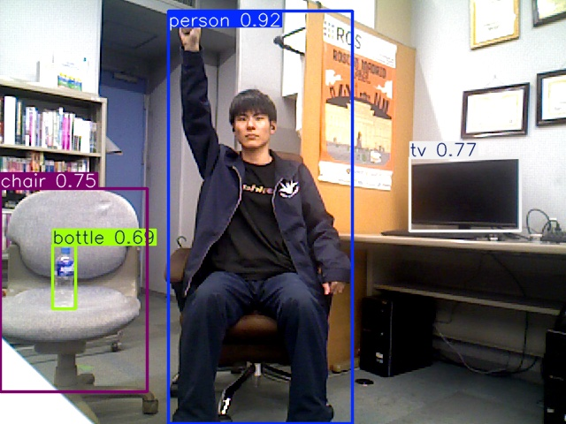
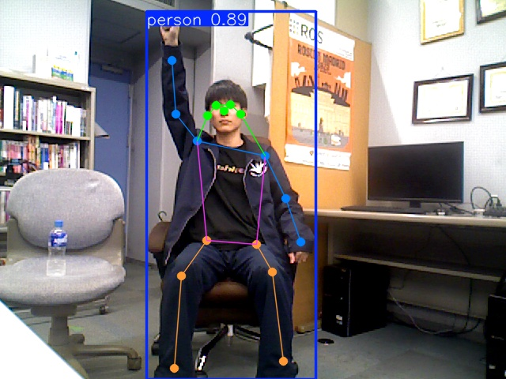
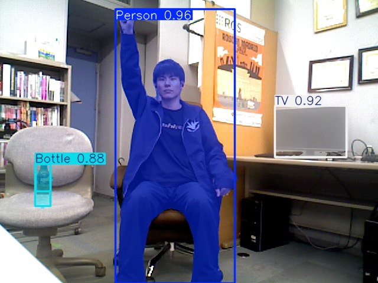

<a name="readme-top"></a>

[EN](README.md) | [JA](README_ja.md)

[![Contributors][contributors-shield]][contributors-url]
[![Forks][forks-shield]][forks-url]
[![Stargazers][stars-shield]][stars-url]
[![Issues][issues-shield]][issues-url]
[![License][license-shield]][license-url]

# YOLO ROS

<details>
  <summary>目次</summary>
  <ol>
    <li><a href="#概要">概要</a></li>
    <li>
      <a href="#セットアップ">セットアップ</a>
      <ul>
        <li><a href="#環境条件">環境条件</a></li>
        <li><a href="#インストール方法">インストール方法</a></li>
      </ul>
    </li>
    <li><a href="#実行操作方法">実行・操作方法</a></li>
    <li><a href="#パラメーター">パラメーター</a></li>
    <li><a href="#トピック">トピック</a></li>
    <li><a href="#デモ">デモ</a></li>
    <li><a href="#参考文献">参考文献</a></li>
  </ol>
</details>

## 概要
`yolo_ros` は，Ultralytics YOLO モデル（YOLO26 系の検出・姿勢推定・セグメンテーション，および YOLOE）を ROS 2 で利用するためのライフサイクル対応ラッパーパッケージです．

**主な機能：**
- 物体検出（`Detection2DArray`）
- 人物姿勢推定（`KeyPointArray`）
- インスタンスセグメンテーション（`DetectMaskArray`）
- YOLOE によるプロンプトベースの検出・セグメンテーション
- Conv+BN 層の融合による高速化（`fuse`）
- ROS 2 ライフサイクル完全対応（`configure` → `activate` → `deactivate` → `cleanup`）
- 全パラメーターを `ros2 param set` でランタイムに変更可能

<p align="right">(<a href="#readme-top">上に戻る</a>)</p>


## セットアップ

### 環境条件

| システム | バージョン |
| -------- | ---------- |
| Ubuntu   | 24.04 (Noble Numbat) |
| ROS 2    | Jazzy Jalisco |
| Python   | 3.12 |

### インストール方法
1. ROS 2 の `src` フォルダに移動します．
   ```sh
   cd ~/colcon_ws/src/
   ```
2. 本レポジトリをクローンします．
   ```sh
   git clone https://github.com/TeamSOBITS/yolo_ros.git
   ```
3. レポジトリの中へ移動し，依存パッケージをインストールします．
   ```sh
   cd yolo_ros
   bash install.sh
   ```
4. パッケージをビルドします．
   ```sh
   cd ~/colcon_ws/
   colcon build --symlink-install
   source install/setup.bash
   ```

<p align="right">(<a href="#readme-top">上に戻る</a>)</p>


## 実行・操作方法

1. カメラトピックを指定して起動します：
   ```sh
   ros2 launch yolo_ros yolo.launch.py image_topic_name:=/camera/color/image_raw
   ```

2. 起動時に自動で configure・activate する場合：
   ```sh
   ros2 launch yolo_ros yolo.launch.py auto_configure_2d:=true auto_activate_2d:=true
   ```

3. ライフサイクルを手動で管理する場合：
   ```sh
   ros2 launch yolo_ros yolo.launch.py
   ros2 lifecycle set /yolo_node configure
   ros2 lifecycle set /yolo_node activate
   ```

4. ランタイムにモデルを切り替える場合（fuse は不可逆のため deactivate が必要）：
   ```sh
   ros2 lifecycle set /yolo_node deactivate
   ros2 param set /yolo_node weight_file yolo26n-pose.pt
   ros2 lifecycle set /yolo_node activate
   ```

5. 3D 座標変換パイプラインを有効にする場合：
   ```sh
   ros2 launch yolo_ros yolo.launch.py use_bbox_to_3d:=true use_keypoint_to_3d:=false use_mask_to_3d:=false
   ```

<p align="right">(<a href="#readme-top">上に戻る</a>)</p>


## パラメーター

以下のパラメーターはランチファイルまたは `ros2 param set` で設定できます．

| パラメーター名         | 説明                                                                                          | デフォルト値                        | ランタイム変更  |
| ---------------------- | --------------------------------------------------------------------------------------------- | ----------------------------------- | --------------- |
| `weight_file`          | YOLO の重みファイル名                                                                         | `yolo26n.pt`                        | inactive 時のみ |
| `weights_path`         | 重みファイルが格納されているディレクトリ                                                       | `<package>/weights`                 | inactive 時のみ |
| `conf`                 | 検出の信頼度閾値（0.0, 1.0]                                                                   | `0.35`                              | 可              |
| `iou`                  | NMS の IoU 閾値（0.0, 1.0]                                                                    | `0.7`                               | 可              |
| `filter_classes`       | 検出対象を絞り込むクラス名のリスト（空 = 全クラス）                                            | `['']`                              | 可              |
| `keypoint_name_list`   | 姿勢推定時のキーポイント名リスト（位置順，モデルのキーポイント数以内）                         | `['']`                              | 可              |
| `yoloe_prompts`        | YOLOE モデルで使用するテキストプロンプト（YOLOE 使用時は必須）                                | `['']`                              | 可              |
| `image_reliability`    | 画像サブスクリプションの QoS 信頼性（`best_effort`，`reliable`，`system_default` など）        | `best_effort`                       | inactive 時のみ |
| `device`               | 推論デバイス（`cuda`，`cpu`，`cuda:0` など）                                                  | CUDA 利用可能なら `cuda`，否は `cpu` | inactive 時のみ |
| `fuse`                 | ロード後に Conv+BN 層を融合して推論を高速化するか                                              | `true`                              | inactive 時のみ |
| `auto_configure_2d`    | 起動時に YOLO ライフサイクルノードを Configure するか                                         | `false`                             | —               |
| `auto_activate_2d`     | 起動時に YOLO ライフサイクルノードを Activate するか                                          | `false`                             | —               |
| `auto_configure_3d`    | 起動時に image_to_position ライフサイクルノードを Configure するか                            | `false`                             | —               |
| `auto_activate_3d`     | 起動時に image_to_position ライフサイクルノードを Activate するか                             | `false`                             | —               |
| `use_bbox_to_3d`       | `bbox_to_3d` の3D検出パイプラインを起動するか                                                 | `true`                              | —               |
| `use_keypoint_to_3d`   | `keypoint_to_3d` の3Dパイプラインを起動するか                                                 | `false`                             | —               |
| `use_mask_to_3d`       | `mask_to_3d` の3Dパイプラインを起動するか                                                     | `false`                             | —               |

> **注意：** `weight_file`，`weights_path`，`device`，`fuse`，`image_reliability` は，ノードが `inactive`（deactivate 済み）状態のときのみ変更できます．

<p align="right">(<a href="#readme-top">上に戻る</a>)</p>


## トピック

### 配信（Publications）

| トピック名                  | 型                                    | 説明                                       |
| --------------------------- | ------------------------------------- | ------------------------------------------ |
| `<node>/detected_image`     | `sensor_msgs/Image`                   | アノテーション付き可視化画像               |
| `<node>/object_boxes`       | `vision_msgs/Detection2DArray`        | 検出インスタンスごとのバウンディングボックス |
| `<node>/object_keypoints`   | `sobits_interfaces/KeyPointArray`     | キーポイント（姿勢推定モデル使用時）        |
| `<node>/object_masks`       | `sobits_interfaces/DetectMaskArray`   | インスタンスマスク（セグメンテーションモデル使用時） |

### 購読（Subscriptions）

| トピック名             | 型                      | 説明               |
| ---------------------- | ----------------------- | ------------------ |
| `<image_topic_name>`   | `sensor_msgs/Image`     | 入力カメラ画像     |

> `<node>` のデフォルトは `yolo_node` です．ランチ引数 `node_name` で変更できます．

<p align="right">(<a href="#readme-top">上に戻る</a>)</p>


## デモ

| 物体検出 | 姿勢推定 | セグメンテーション |
|:---:|:---:|:---:|
|  |  |  |

### 物体検出
```bash
ros2 lifecycle set /yolo_node deactivate
ros2 param set /yolo_node weight_file yolo26n.pt
ros2 param set /yolo_node filter_classes "['person', 'laptop']"
ros2 lifecycle set /yolo_node activate
```

### 姿勢推定
```bash
ros2 lifecycle set /yolo_node deactivate
ros2 param set /yolo_node weight_file yolo26n-pose.pt
ros2 param set /yolo_node keypoint_name_list "['nose', 'left_eye', 'right_eye']"
ros2 lifecycle set /yolo_node activate
```

### セグメンテーション
```bash
ros2 lifecycle set /yolo_node deactivate
ros2 param set /yolo_node weight_file yolo26n-seg.pt
ros2 lifecycle set /yolo_node activate
```

### YOLOE セグメンテーション
```bash
ros2 lifecycle set /yolo_node deactivate
ros2 param set /yolo_node weight_file yoloe-26n-seg.pt
ros2 param set /yolo_node yoloe_prompts "['bottle', 'laptop']"
ros2 lifecycle set /yolo_node activate
```

<p align="right">(<a href="#readme-top">上に戻る</a>)</p>


## モデルのダウンロード

使用するタスクの `.pt` ファイルをダウンロードし，[weights](./weights/) ディレクトリに配置してください：

```
yolo_ros/weights/<モデル名>.pt
```

| タスク | モデルページ |
| ------ | ------------ |
| 物体検出 | [YOLO26 Detection Models](https://docs.ultralytics.com/tasks/detect#models) |
| セグメンテーション | [YOLO26 Segmentation Models](https://docs.ultralytics.com/tasks/segment#models) |
| セマンティックセグメンテーション | [YOLO26 Semantic Models](https://docs.ultralytics.com/tasks/semantic#models) |
| 姿勢推定 | [YOLO26 Pose Models](https://docs.ultralytics.com/tasks/pose#models) |
| YOLOE（オープン語彙） | [YOLOE-26 Models](https://docs.ultralytics.com/models/yolo26#yoloe-26-open-vocabulary-instance-segmentation) |

配置後，`weight_file` ランチ引数またはランタイムで指定します：
```sh
ros2 param set /yolo_node weight_file yolo26n.pt
```

<p align="right">(<a href="#readme-top">上に戻る</a>)</p>


## 参考文献
* [Ultralytics ドキュメント](https://docs.ultralytics.com/ja/)

[contributors-shield]: https://img.shields.io/github/contributors/TeamSOBITS/yolo_ros.svg?style=for-the-badge
[contributors-url]: https://github.com/TeamSOBITS/yolo_ros/graphs/contributors
[forks-shield]: https://img.shields.io/github/forks/TeamSOBITS/yolo_ros.svg?style=for-the-badge
[forks-url]: https://github.com/TeamSOBITS/yolo_ros/network/members
[stars-shield]: https://img.shields.io/github/stars/TeamSOBITS/yolo_ros.svg?style=for-the-badge
[stars-url]: https://github.com/TeamSOBITS/yolo_ros/stargazers
[issues-shield]: https://img.shields.io/github/issues/TeamSOBITS/yolo_ros.svg?style=for-the-badge
[issues-url]: https://github.com/TeamSOBITS/yolo_ros/issues
[license-shield]: https://img.shields.io/github/license/TeamSOBITS/yolo_ros.svg?style=for-the-badge
[license-url]: LICENSE
